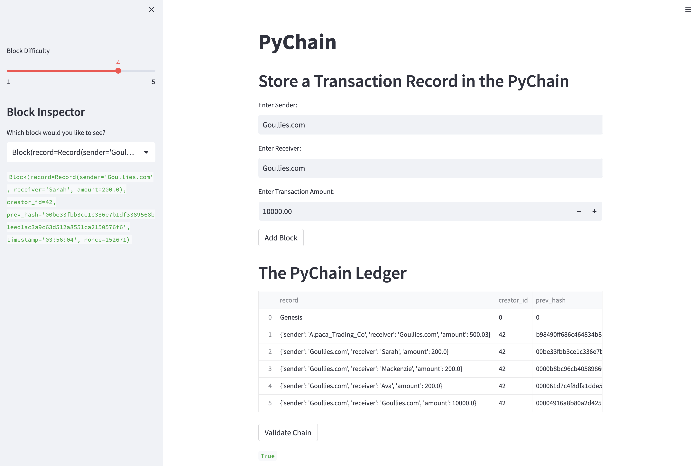
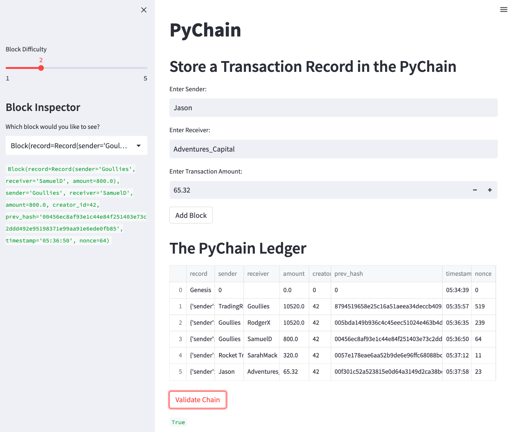
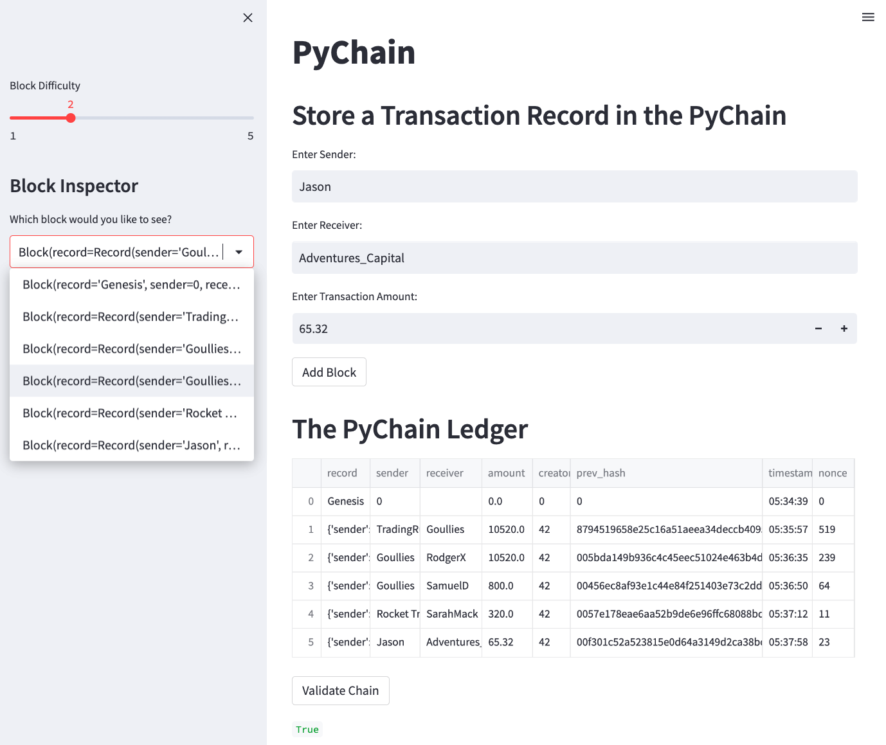

# Module_18_PyChain
####  A basic blockchain based ledger system with a Streamlit web interface

# PyChain Ledger

As a fintech engineer who’s working at one of the five largest banks in the world, I was recently tasked to build a blockchain-based ledger system, complete with a user-friendly web interface. This ledger allows partner banks to conduct financial transactions and to verify the integrity of the data in the ledger.

I have:
1. Created a new data class named `Record`. This class will serve as the blueprint for the financial transaction records that the blocks of the ledger will store.

2. Modified the existing `Block` data class to store `Record` data.

3. Added Relevant User Inputs to the Streamlit interface.

4. Tested the PyChain Ledger by Storing Records.

5. I have also added separate columns for the ease of the reader.

I have coded input areas for the user interface of the Streamlit application. These input areas to capture the sender, receiver, and amount for each transaction that are stored in the `Block` record.

To take the streamlit application a little further, I have also added additional columns to separately display entered information of the transaction for the ease of the reader.

These examples also have been tested to see if the transaction is valid.

With the Block Inspector, you are able to verify the block contents and hashes in the Streamlit dropdown menu.

